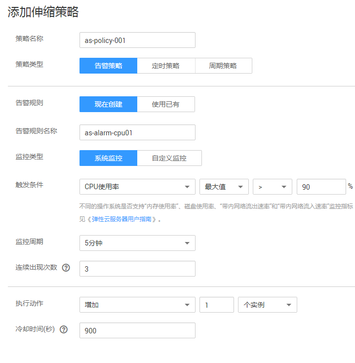
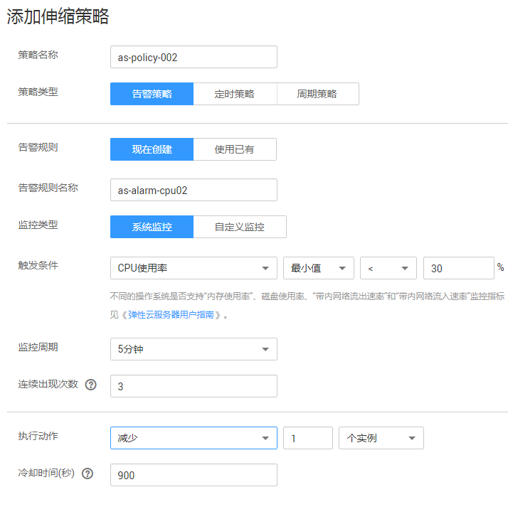

# 动态扩展资源

弹性伸缩进行伸缩活动时，需定义如何按照不断变化的需求进行伸缩活动，即动态扩展资源。

当业务需求变化频繁且无固定规律时，可通过配置告警策略实现动态扩缩资源的目的。当满足伸缩策略的条件时，系统自动修改期望实例数，从而触发伸缩活动进行资源的扩张或收缩。如何创建告警策略请参考[创建伸缩策略](创建伸缩策略.md)进行操作。

例如，一个支持用户进行购买火车票的Web应用程序，当运行该应用程序的实例的CPU使用率上升到90%时，需要增加一个实例，以确保业务正常运行，在CPU使用率下降到30%时需删除一个实例，以减少资源的浪费。根据以上情况，可以配置两条告警策略，第一条告警策略设置触发条件为：CPU使用率最大值大于90%，执行动作为：增加一个实例。可参考[图1](#fig55871376518)进行配置。第二条告警策略设置触发条件为：CPU使用率最小值小于30%，执行动作为：减少一个实例。可参考[图2](#fig27851611612)进行配置。

**图 1**  告警策略01  

**图 2**  告警策略02  

